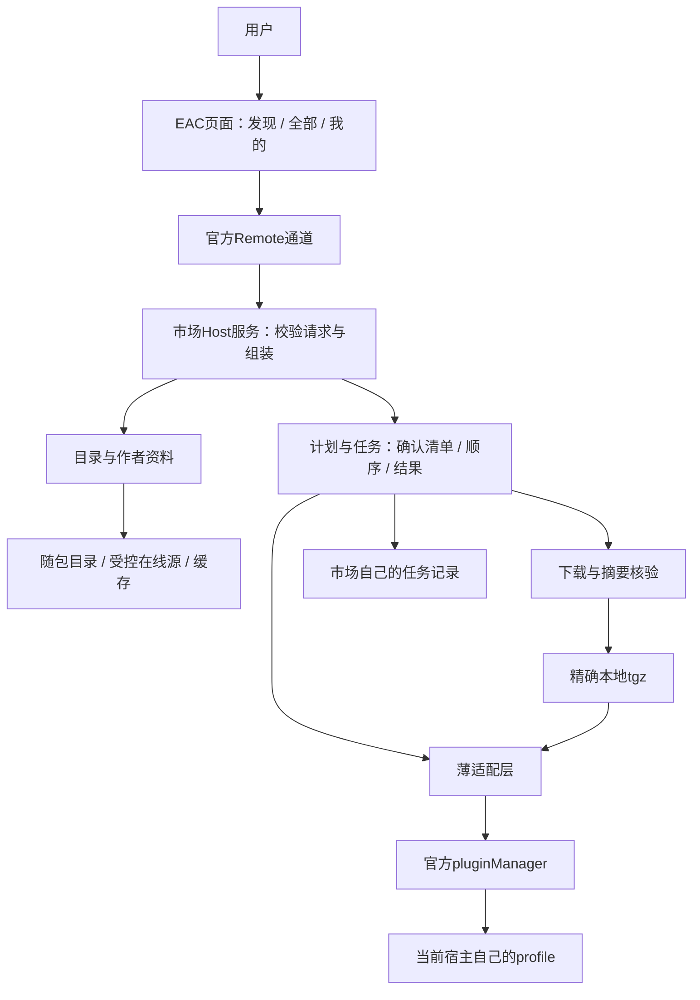
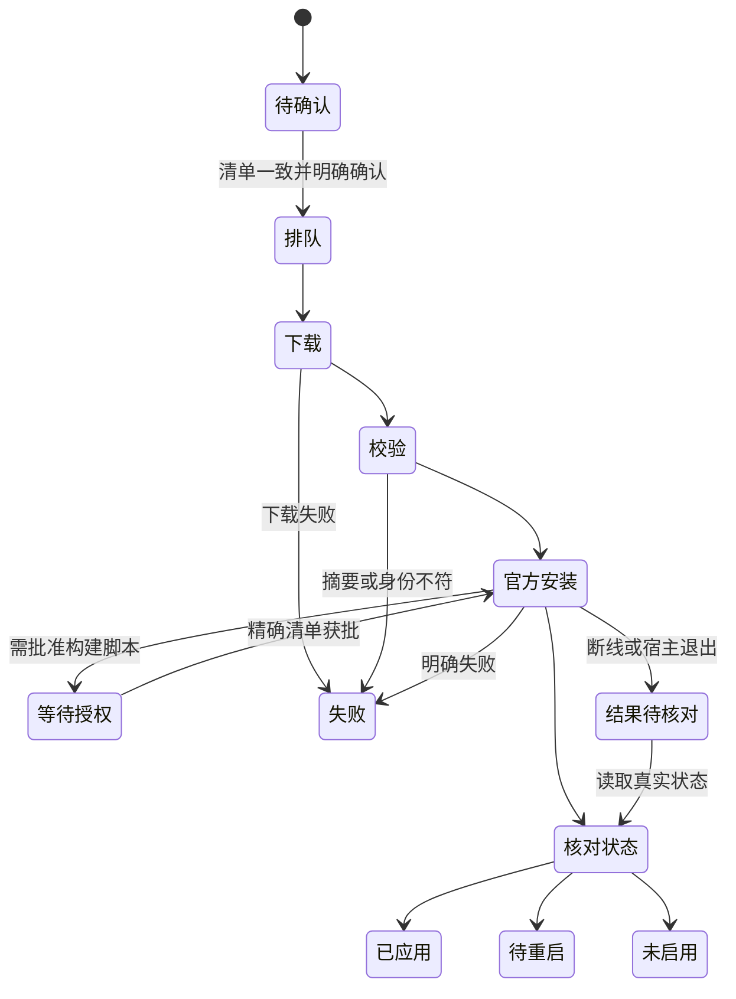

# EAC 插件市场 MVP：可执行开发计划

版本：v1，2026-09-27。状态：**供审定和交给下一模型实施的计划**；本轮只调查和写文档，尚未实现或实测市场。最新需求优先级见 [PRODUCT.md](PRODUCT.md)，全部来源见 [PROTOCOL-EVIDENCE.md](PROTOCOL-EVIDENCE.md)。

## 1. 要交付的最小完整产品

用户在官方 DSH 侧栏打开 EAC 页面，看懂一个插件或套餐的用途，查看将安装/更换的版本，一次确认后完成下载、校验和安装；能查看真实启用/需重启/失败状态，找到官方设置或使用说明，管理已装插件。网络故障时保留可用目录和任务记录，不能把部分成功写成全部完成。

作者可以在次级入口编辑介绍、导入公开 GitHub README、预览、保存本地草稿、导入/导出介绍资料包；团队收到资料后按文档校验并维护目录。在线作者账号、认领、投稿、审核、自动发布和所有 Star 功能留待下一版。

本次最终产物是**标准 DSH 插件 `.tgz`、SHA256、源码及交接文档**，另有隔离环境测试记录。不是重新制作 EAC/DSH 的 NSIS 安装器，不交付完整全家桶，不修改官方源码，也不承诺把所有旧 EAC 插件直接兼容过来。

当前官方 `installBundle` 只接受声明有效 `dsh.bundle.patch` 的包。这里的「标准插件一键安装」指符合此入口的bundle（带明确加载声明的插件包），不是任意npm包。普通Host/Client包可先收录介绍；优先请作者补bundle声明，或后续制作经许可的wrapper bundle（包装包，依赖原插件并声明加载）。包装会增加版本/依赖维护成本，不能在用户安装时悄悄生成。CLI明确拒绝操作Desktop专属profile，也不能作为绕过入口。

完成判据：从最终 `.tgz` 在干净官方 Desktop 环境安装市场，走完至少一个真实单插件及一个包含失败项的组合安装流程，检查磁盘、官方服务与 UI 一致；作者资料往返不丢内容。若仅浏览器 mock 成功、仅 CLI 成功或仅文件存在，不能称为 MVP 完成。

## 2. 技术选择与推荐方案

本表是给用户审定的推荐，不把尚未选择的底层细节写成用户原话。接受整份计划后，实施者按推荐推进；遇到会改变范围、权限或用户体验的新路线，再列选项。常规修复无需反复要求用户点「继续」。

| 决策 | 方案与优劣 | 推荐 |
|---|---|---|
| 实现基础 | A 从零重写：干净但慢、易漏协议；B 直接包装旧安装器：快但继承已发现缺陷；C 独立市场工程，复用已验证的纯类型/校验与官方服务：边界清晰，需要先做接入验证 | C；与安装器维护者保持接口对齐，不抢改其分支 |
| 界面与安装运行位置 | A 独立桌面壳：控制多、维护重且不符定位；B 标准插件的 Client/Host 双入口：复用官方能力、轻量 | B。Client 是页面，Host 是 DSH 内负责文件和安装的服务 |
| 安装实现 | A 直接写 YAML/执行 pnpm：自由但容易破坏官方规则；B 调官方 pluginManager：有现成锁、权限及状态；C shell/CLI fallback：可覆盖缺服务环境，但语义和隔离不易一致 | B；MVP 不启用无法证明等价的 C |
| 内容与目录 | A 所有资料塞进插件代码：易交付但每次改介绍都要发版；B 远程目录独占：灵活但断网不能看；C 随包目录+线上目录+最近有效缓存，介绍独立 | C，目录更新与安装分离 |
| 下载制品 | A URL 直接交 manager：简单但市场无法保证装的是校验过的字节；B Host 下载、核验后交本地 tgz：链路可追踪，需要保留引用缓存 | B；同版本镜像只替代同一份字节 |
| 存储 | A 共享 storageDomain：方便但默认不按 profile 隔离；B profile 内原子 JSON：规模小、无数据库依赖；C SQLite：事务强，原生依赖/部署成本更高 | B；写队列、市场自有锁、分页和版本化数据格式 |
| 作者工具 | A 复杂富文本/在线平台：体验强但拖慢首版；B Markdown 工具栏+预览+资料包：轻量、便于 Git 协作 | B，保留未来在线服务接口说明 |
| 下载来源选择 | A 每次让用户挑镜像：易解释但繁琐；B 自动选择已登记同制品来源，设置可改偏好 | B；不自动换插件版本、不碰用户全局代理设置 |
| 各平台 | A 同时保证全平台：验收成本高；B 先保证 Windows x64 官方 Desktop，其他平台保留能力降级 | B；未测的平台不写「已支持」 |
| 普通非bundle插件接入 | A 作者发布自带bundle：最直接、版本一一对应；B 独立wrapper bundle：保留原包但多一层维护；C 市场私自写用户加载行：省事但易重复注册/越界 | MVP接受A及已验收的B；不做C |

**术语**：契约是调用双方约定的参数和结果；adapter（适配层）把官方接口翻译为市场统一接口；schema 是检查数据字段是否合法的规则；digest（摘要）用于检查文件字节是否相同；fixture 是专供测试的样本，不能充当真实兼容证明。

## 3. 开工前必须读什么

按依赖顺序阅读，不按文件数量凑阅读量。

1. 本目录 README、PRODUCT、本文、UI 任务书、验收矩阵、提示词；用户最新消息和真实授权。
2. `D:/DSH-EAC/AI协作教训与团队规范备忘.md`；将新工程适用规则写入 AGENTS，不照抄旧审批/CI 数量。
3. EAC 当前分支状态与 beta 交接、beta-pack 安装器、Mojobox 的 AGENTS/CONTRIBUTING/architecture/Schema/正反例；用只读 refs 查看，保留别人修改。
4. 官方 `package.json.dsh` 类型、bundle 加载、ui-plugin-manager 的 main/sidebar 注册、Remote/Typert、pluginManager、profileContext、原子写文件接口。
5. 官方真实 Desktop 的隔离启动、profile 管理、包管理进程和 fatal recovery；区分官方完整版与旧 EAC stub。
6. 三类代表输入：一个普通标准 DSH 插件、一份套餐 Lock、一份独立作者介绍。内容不齐用明确的测试 fixture 补测试，不伪造生产样本。

资料冲突时记录「哪份、哪个版本、哪个字段」，由主控收口；公共协议冲突交维护者裁决。未验证的运行行为进入能力门槛，不能把注释当运行证据。

## 4. 工程布局与所有权

建议未来工程位置 `D:/eac-market`，测试环境 `D:/eac-market-verify`。这是计划建议路径，**本轮没有创建代码仓库**。若已有同名目录先检查；不能覆盖。推荐包名 `@dsh-eac/market`、Host 服务 `eacMarket`、面板 `eac-market`：均须 M0 查冲突，npm scope 发布权未核实前仅本地打包，不宣称已注册。

**路径约定**：工作区根记作W=`D:/eac-market`；插件包根记作P=`W/packages/market`。本计划各处的 `src/`、`data/`、`lib/`、`cordis.patch.yml` 相对P；`tests/`、`docs/`、`schemas/`、`scripts/`相对W。根package.json只管开发工具，不发布；P/package.json才是插件清单。这样满足当前官方生成器仅发现`packages/`下、由根聚合tsconfig直接引用项目的条件。

```text
eac-market/
  AGENTS.md                      本工程协作、边界、实际命令
  README.md                      用户安装入口与开发文档总目录
  PRODUCT.md                     产品事实；变更需有来源
  DESIGN.md                      已验证设计系统和视觉决策
  package.json / pnpm-lock.yaml   仅主控修改；工具与依赖版本锁定
  pnpm-workspace.yaml             声明packages/market
  tsconfig.host.json              直接reference包的Host配置
  tsconfig.client.json            直接reference包的Client配置
  scripts/                       构建、Typert生成、打包、校验
  packages/market/
    package.json                 真正发布的插件清单与exports
    cordis.patch.yml             bundle自带加载声明；只注册一遍
    tsconfig*.json               包内Host/Client配置
    src/
      index.ts                   Host薄入口
      types.ts                   对外Client-safe契约导出
      contracts/                 DTO、schema、错误、事件、版本握手
      core/                      纯算法：计划、依赖排序、状态归并
      host/                      Cordis服务注册、权限检查、组装
      adapters/dsh/              官方API、环境、能力与事件映射
      catalog/                   公共目录解析与市场视图模型
      delivery/                  来源、下载、字节校验、缓存引用
      persistence/               profile隔离、原子写、任务日志及迁移
      authoring/                 草稿、README导入、媒体、资料包进出
      client/                    三主页面、详情、任务、作者工具
    data/                        受控随包目录与无网络可读介绍
    lib/                         构建生成的运行代码、类型与描述符
  schemas/market/                市场私有格式；不冒充官方 Schema
  vendor/                        确需带入的固定协议资料、版本与许可
  tests/
    contracts/ core/ adapter/ catalog/ delivery/ persistence/ authoring/
    client/ integration/         mocks 与真实宿主验收分开
  fixtures/                      自建测试插件/目录；排除生产发布目录
  docs/
    index.md                     文档总目录
    architecture.md              依赖方向与模块职责
    host-capabilities.md         官方接口证据与能力表
    protocol.md                  Remote、对象、状态、错误
    catalog-maintenance.md       添加插件/套餐/内容/来源
    author-guide.md              编辑、导入、导出和许可
    upgrade-guide.md             DSH、协议、存储、界面、未来功能升级
    troubleshooting.md          能执行的排错与限制
    testing.md / decisions/      验收及选型记录
  .verify/                       脱敏证据、截图、报告，不放凭据
  dist/                          生成包，不手工编辑
```

推荐 TypeScript、ESM、Host/Client 分开构建，复用官方 React 与控件，不把 Node 模块打入 Client。底层 bundle 工具先比较官方示例工具链与团队现有脚本，以**能正确输出客户端、运行时 schema 和可解析 exports**为选择依据；本计划不捏造通用官方脚手架命令。

依赖方向：Client → contracts → Host service → core/ports → adapter/delivery/persistence。core 不依赖 Cordis、React、Node 文件系统或网络。公开 DTO 不含本机绝对路径、token、原始环境变量和可执行回调。



直观理解：页面负责让人看懂和选择；市场安排清单、下载与记录；真正改动DSH插件的步骤交给官方管理器，避免两套系统各改各的。

## 5. 标准接入与自我保护

### 5.1 第一条必须先跑通的链

`最终 tgz → 官方安装入口 → bundle 声明 → Host Remote 注册 → Client schema 解析 → sidebar/main 注册 → 显示当前环境信息`。

M0 仅做这一条小链和 read-only hello，不先把八个页面写满。必须检查 `npm pack --dry-run` 与解包清单；不满足时修自己打包/适配，不修改官方包、不复制 EAC 的管理 stub、不手写额外用户层 insert。

### 5.2 官方服务与能力降级

Host 从 `ctx.profileContext` 确定环境，读取已装 bundle、版本、启停与可操作状态；使用正式 pluginManager 服务。能力报告最少区分浏览、安装、启停、卸载、配置导航、重启交接。缺能力只禁对应操作，不让整个市场白屏。

官方`listBundles`表示包/组合，`listPlugins`表示实际加载行；二者不是同一个“插件”。adapter保留bundle内rows与只读理由，UI以包为主、必要时展开成员，不能把用户关闭的某一加载行在升级时重新打开。普通无bundle依赖未必出现在listBundles，市场不声称枚举了所有node_modules。

Client 注册 main panel 与 sidebar 入口；使用官方远程机制，不能自己开 WebSocket/HTTP 控制口。用官方布局导航到插件配置；账号与 API Key 配置留在插件/官方对应页面，市场不收集或代理凭据。

市场自身及保证其运行的官方核心依赖不进入套餐自动替换/卸载目标。市场自更新首版走官方管理入口与发行说明，不让正在工作的市场把自己卸载。普通插件移除以官方可移除判定为准。

### 5.3 Typert 与打包门槛

Typert 是官方让两端理解服务参数/结果的机制。类型在编译时消失，**只有 `.d.ts` 不足以满足运行时 schema**。根据当前官方生成器/示例生成 Host 与 Client 描述、被引用的运行时 schema 和类型声明；每条 `<包>/types#符号` 必须在最终包中可解析，`exports` 与 `files` 都要覆盖。

测试从解包后安装的文件调用解析器，不能只检查源码里有没有字符串。官方 Desktop 中 Host 激活和 Client 页渲染分别取证。成功后冻结一个最小 golden fixture，后续打包变更必须复跑。

**已查明的生成入口与落地步骤**：

1. 构建工具可用官方公开的 `WorkspaceTypertGenerator`，从 `@deepseek-ai/dsh-typert-generator` 导入；显式传W。根Host/Client tsconfig直接reference P内对应配置，不能只把源码放根src等待自动发现。
2. 按官方对应版本的TypeScript配置先生成 `lib/types/**/*.js` 与 `.d.ts`，同时输出Host/Client bundle。`types.js`来自TypeScript构建，Typert生成器**不会替你补这个模块**；`.d.ts`不是可加载JS。
3. 调用 `new WorkspaceTypertGenerator(workspaceRoot).generate([packageName], ['host', 'client'])`，按返回的 `packageRoot/face/js/dts/remote` 写入**已验证属于P**的lib路径。生成器只是返回产物，调用方负责落盘；可参考官方 `tsdown-plugin.ts` 的emitArtifacts。
4. 或直接使用公开`/tsdown`插件：配置少，但依赖其工作区发现规则。推荐M0用显式root的公开API排错；验证后可收口为官方tsdown插件，不同时维持两套生成真源。
5. 最终exports至少包括主入口、`./client`、`./types`、`./typert`、`./remote`及确有需要的`./package.json`。若生成器实际产生Client face，再配`./client/typert`；没有该face不能发布虚构路径。所有显式Typert文件要按生成器要求逐条列入files，不能只写一个宽泛glob期待其校验认可。
6. 对应产物：`lib/index.js`、`lib/client.js`、`lib/types/types.js/.d.ts`、`lib/typert.host.js/.d.ts`、`lib/typert.remote-client.js/.d.ts`；Client face若有则加`lib/typert.client.js/.d.ts`。导入的其他types运行模块也必须进入tgz，不能只列根文件。
7. 官方源码中的`workspace:*`依赖是其仓库内部约定。独立市场需用实测且可获取的具体版本/peer范围，不能把未解析的workspace占位发布出去。生成器、TypeScript仅开发依赖，不随市场作为常驻运行工具。
8. M0还要确认 `ctx.typert.local.get(<真实端点>)` 有严格接口描述。HTTP成功可能走SRC回退，不能用成功响应掩盖缺失的生成描述符；该检查放测试，不暴露不必要调试RPC。

Host服务依赖、Client运行时service inject与package级`dsh.client.inject`是不同声明，逐一跟实际官方示例对齐。包名/版本示例不能替代实际exports解析测试。

## 6. 数据分层：目录、介绍、来源、证据

| 层 | 内容 | 权限与更新规则 |
|---|---|---|
| Catalog/Manifest | 插件身份、精确版本、官方 metadata 投影、依赖、能力 | 按固定 Mojobox/上游 schema 校验；不能从介绍正文推断 |
| Pack + Lock | 套餐意图、必需/可选项、锁定版本与摘要 | 复用公共格式；ID、版本、组件关系必须一致 |
| PackExecution | 套餐组件的先后依赖、运行前置条件、关系是否已核实 | 市场私有附属记录，绑定精确Pack/Lock，不能改写公共requires语义 |
| Presentation | 标题、简介、图片、Markdown、教程、公开来源署名 | 市场独立格式；作者可编辑；不决定执行权限 |
| Delivery | 同一制品的候选 URL/registry、摘要、大小、来源优先级 | 维护者登记；ID/version/artifactDigest 必须吻合 |
| Evidence | 在哪种宿主/版本/系统、哪个制品上跑了什么验证 | 实际测试才新增；旧证据不改成新版本证据 |
| Local state | 当前环境、用户确认、任务结果、缓存引用、本地草稿 | 只在 profile 私有目录；不写回公共目录/作者稿件 |

为市场独立定义 `MarketIndex v1 / PackExecution v1 / Presentation v1 / Delivery v1 / AuthorExport v1` schema，均含 `schemaVersion`。Index 记录精确 revision、对象引用与摘要、生成时间和来源；不要求公共 Mojobox 对象新增同义字段。

**依赖关系的事实源**：已读Mojobox Pack的components只有id/version/required，requires用于宿主能力/平台，不能据此编造组件依赖图。市场新增独立PackExecution记录：`schemaVersion`、`packId`、`packVersion`、`lockDigest`（Lock原字节摘要）、`coverage: complete|partial|unknown`、`edges`、`provenance`。每条edge明确`prerequisiteId`、`consumerId`、`milestone: installed|active`；精确版本沿所绑定Lock取值，禁止引用不存在的组件。provenance记录维护者核对依据、来源revision及测试证据，不从自由介绍推断。

`complete + edges:[]`才表示已核实彼此独立；缺字段/缺记录表示未知。MVP只对coverage=complete且关系校验通过的套餐开放完整一键执行；其余仍可展示、预演已知信息或转单插件操作，清楚说明“套餐执行资料待完善”，不照展示顺序猜安装顺序。该取舍优于改公共Schema，也比“未知都当无依赖”可靠。首版测试套餐必须带真实校验过的私有记录，后续正式收录时一并维护。

目录刷新：先拉临时快照 → 限制体积并校验全部引用 → 原子切换当前快照 → 保留最近有效缓存。失败继续使用旧快照，显示更新时间/离线状态。刷新不能使已确认计划指向新的制品；新目录不静默安装插件。

只配置维护者认可的 HTTPS 源；普通用户设置可选择这些源的优先级。网络导入不访问本机/内网私有地址、不携带 GitHub cookies；测试本地服务须显式测试配置并排除生产。远程重定向逐次检查，拒绝把 HTTPS 来源静默降到不安全协议。网络超时、条目数、正文/图片/归档解压体积都有上限，达到上限给可理解错误。

有源码没有合法制品：仍可浏览介绍，标「尚无可安装版本」。有官方 DSH 包、缺社区额外元数据：可以通过适配记录收录，不能发明它具备未声明 facet，也不强迫作者实现非官方协议。

## 7. 冻结内部契约，再让子智能体并行

以下是**市场自身建议 API，不是官方现成 API 名称**。主控在 M1 写成真实类型和运行时 schema、正反 fixtures，子智能体按合同开发。

| 方法组 | 请求与结果的关键内容 |
|---|---|
| `hello` | protocol/schema版本、Host package版本、可用能力、当前环境opaque ID；主版本冲突禁止写入 |
| `catalog.list / detail / refresh` | revision、查询、分页cursor；插件/套餐条目、展示资料、来源与新鲜程度 |
| `inventory.list` | 当前已安装/随附bundle、版本、启停、来源种类、可移除/只读理由 |
| `plan.create` | 目录revision、选择的插件/套餐、可选组件、用户启用意图；返回不可变计划与逐项影响 |
| `task.start` | Host 保存的planId+planDigest、明确确认项、幂等键；返回taskId或需重新确认 |
| `task.get / list / events` | 持久化结果、单调event序号、分页/补齐；无结果不能伪造成功 |
| `task.cancel` | 取消申请与实际取消结论；返回不可取消原因 |
| `task.approveBuilds` | taskId、attemptId、approvalChallengeId、pendingBuildsDigest、精确批准包名、幂等键；按Host保存的挑战继续对应步骤，不重新创建任务 |
| `task.resume` | taskId、Host返回的resumeChallengeId/resumeDigest、幂等键；用于已核对的重启后继续，当前影响变化则要求重新确认 |
| `plugin.setEnabled / remove` | 目标环境/插件及当前状态版本、确认的影响；同一写队列执行并重新核验 |
| `author.draft.* / readme.import` | 草稿revision、内容、固定公开来源；并发修改冲突不能默默覆盖 |
| `author.export / import` | 介绍资料包ID、schemaVersion、文件映射、导入检查报告；不执行包内代码 |
| `diagnostics.export` | 用户触发、经脱敏有界报告；不包含账号、API Key、cookie或用户会话 |

每个命令有稳定错误code、用户可读message、是否可重试、需要的下一步；底层细节在脱敏诊断中。区分 `unsupported / blocked / failed / partial / unknown`，不用一个 `ok` 把不同结果揉在一起。

所有Remote调用走官方认证/调用上下文，Host做runtime schema与当前环境检查；不额外开放匿名HTTP接口。UI清单确认绑定planDigest，但不是新的权限系统：不能仅因来参`confirmed:true`就扩大宿主权限。若将来向Agent工具暴露安装命令，必须另接官方用户批准机制，MVP不顺带暴露自动安装工具。

`EnvironmentIdentity`：Host 根据真实profile canonical path、宿主版本/能力生成内部身份，返回不可逆/不暴露路径的标识；Host每次命令只作用于当前profile。Client不能传一个路径要求操作别的实例。相同账号在不同浏览器标签只是同一环境的多个视图，不能各启动一份相同任务。

`InstallPlan` 最少固定：

- planId、schemaVersion、createdAt、expiresAt；首次start有效期建议15分钟，过期重新核对并确认。已开始任务不会只因下载超过15分钟自动失去原确认，但漂移/恢复仍须重新核对。
- environmentId、hostFingerprint、catalogRevision、Pack ID/版本（若有）。
- 每项的组件ID、包名、来源种类、当前版本/启用/本地身份、目标精确版本与artifactDigest、add/keep/upgrade/downgrade/blocked动作；套餐还固定PackExecution摘要。
- 必需/可选关系、能力及兼容检查、需用户明确认可的未知验证项、用户最终enabled意图。
- 所有修改项的依赖顺序、预计重启与不能自动完成的步骤。
- Host对规范化内部计划算出的planDigest；Client不能仅上传重新拼装的计划来改安装目标。

调用task.start前重新读取目标状态；确认过的状态或能力变化超出清单，返回 `plan/stale` 和差异，重新确认。最终读状态与官方执行之间仍有竞态：官方锁仅保证其写操作串行，市场不能谎称已独占所有外部操作。实际结果与预期不符时停止后续相关步骤并核对，不盲目覆盖。

**排队不是免复查**：在市场锁内为`environmentId + planId`绑定唯一task，幂等键不同也不启动第二个相同计划；按队列真正出队、每个组件的官方写操作前、批准脚本后、重启后继续时都复查。复查基准是初始清单加本任务已经核实的成功变更，不能把自己的前一步误当外部漂移。两个不同计划操作同一插件，第二个出队时发现状态已变，就返回stale/重新确认，绝不沿旧清单覆盖。

## 8. 安装、更新与部分成功

### 8.1 单项流程

1. **读取与预演**：当前环境、已装来源与版本、Bundle身份、官方硬限制、目录证据。普通first-install可用官方inspect；更新不能把 `already-installed` 当最终拒绝，而应读清实际当前版本并走替换计划。
2. **展示清单**：新增、保留、升级、降级、启停意图、重启、额外账号/资源需求、未验证项。拒绝已知不兼容；未知可单独明确确认。
3. **保存计划与任务意图**：先持久化，再接触写操作；重复幂等键只返回原任务。
4. **下载**：按Delivery尝试源；网络失败才重试/切源，最多每源1次额外重试，退避有上限；不无限等待。默认全局下载并发2，按profile安装串行。
5. **校验**：摘要、大小限制、tgz内包名/版本与声明、归档路径和链接安全；不能把下载成功当安装成功。校验不符将该字节隔离为不可用，不自动学习新摘要。
6. **安装同一制品**：传已核验本地 `.tgz` 给官方 installBundle，给独立requestId与明确enabled选项。记录顶层制品与官方结果，传递依赖仍由官方包管理器解析。
7. **授权分支**：官方报告build-blocked/pendingBuilds时，保存approvalChallenge与attemptId，显示所需包及影响；用户通过task.approveBuilds确认精确清单才传approvedBuilds。清单变化重新确认，不能一键批准未知包。当前官方会把允许项持久写入profile的allowBuilds；这不是“只允许本次”，安装失败也不自动撤回。UI必须说明后续影响并记录已保存权限。
8. **核对结果**：ChangeResult每种application都映射；实际inventory版本/启停/错误再次读取。applied仅说明官方应用完成，业务功能是否可用另有验收。
9. **下一步**：已可用→给入口；未启用→给启用操作；缺账号→官方/插件设置；restart-required→说明由用户重启；失败→原因与有界重试。没有官方公开重启入口时只给准确指引，不私自杀进程。

下载源的“多元”首版体现在：经维护的 GitHub/Gitee HTTPS制品、可核验的registry tarball、已校验缓存，经统一Delivery处理。并不等于“任意URL都能运行”。作者README导入与插件下载为不同通道，不能因导入正文添加安装源。

### 8.2 套餐算法

- 先校验Lock、Catalog与绑定的PackExecution一致；解析组件图并拒绝循环/缺前置/依赖未选择的可选项，不把组件展示顺序当安装顺序。选择依赖某可选项的组件时，在确认清单中连同该前置一起选取，不能执行时暗加。
- 显式区分套餐组件依赖和 npm传递依赖；没有可靠的依赖关系时不能猜相互独立。
- 初版按拓扑顺序串行执行写操作。组件A失败但官方确认已安全结束、当前状态可判定，则保留先前成功项；依赖A的组件标blocked-by-dependency。
- 对无依赖关联的B，只有无profile-wide脏状态、无未知脚本/共享影响、官方管理仍可用时才继续。否则暂停剩余，要求核对；“继续无关项”不是忽略磁盘混合态。
- edge为installed时，需已核实对应目标版本在磁盘；edge为active时，还要证明本次运行已加载目标版本。前置返回restart-required，即使磁盘已新版也不满足active；相关组件标blocked-on-restart，不能先启用碰运气。默认暂停其写操作；无关项仍按安全判定继续，整任务显示waiting-restart/部分已完成。
- 每项存结果；汇总区分complete、partial、failed、cancelled、needs-attention。取消了剩余项但前面成功不等于回滚成功；UI仍展示已安装者。
- 套餐中同版本已装项默认复用并保留原状态；升级/降级已有插件保留用户原enabled，除非确认清单明确单独改变。
- 用户本地file/link/fork身份不是单凭npm名称就可替换；不能证明与目录记录同一来源时标需人工处理，不自动覆盖。

**市场自己安装的file依赖要与用户本地开发包区分**：任务成功时记录原Catalog身份、artifactDigest、市场缓存内规范路径、官方持久化依赖引用和实际包版本；此引用仍对应受控不可变缓存、未被外部改写时，才归为market-managed并允许后续更新。缺记录或引用指到外部文件的file/link包仍按用户包保护，不能让这一规则把市场的第二次更新也全部误拦。

### 8.3 取消、断线与重启



图示单组件主路径；取消、部分完成与依赖暂停另外按下述规则汇总，不能简单让任意状态直接跳到成功。

下载可Abort；应用阶段能否取消以官方cancelInstall结论为准。用户点击取消后先显示cancelling，直到结果确定。`too-late` 显示当前阶段不可取消；`not-running` 需要读最终结果或核对，不等于cancelled。

页面关闭不终止Host任务；重新打开读取持久结果+从event序号补齐。DSH进程退出后任务记为interrupted，下一次启动先核对实际安装状态和官方活动请求。`waitForInstall`完成后可能返回null，因此不能作为历史数据库。

不自动重放不确定的写操作。能证明安装新版本但未完成启用/重启时呈现事实；无法证明则unknown，给核对与重新生成计划。相同幂等键跨进程也不重发安装。首版不承诺在任意崩溃点自动恢复全部原状态。

**批准继续协议**：Host将待批准包名规范排序后计算digest，挑战绑定task/attempt/profile/目标制品，持久化到任务。task.approveBuilds只能作用于仍在awaiting-approval的该次尝试；同挑战重复点击只返回同一次继续结果。出队后重核目标与已知批准状态，再调用官方installBundle传精确approvedBuilds；官方仍会校验是否pending，stale-approval进入重新获取清单，绝不自行改allowBuilds来绕过。后续新增待批准包使用新attempt/challenge；页面刷新读回已有挑战，不再start另一任务。结果中分开记录`permissionChanges`与`installOutcome`，支持“权限已保存、安装失败”。

**重启继续协议**：Host换进程后核对loader/库存/前置目标版本与新的运行会话，不能仅凭磁盘package.json断言旧进程已用新版。对能证明active前置已满足的剩余清单生成resumeChallenge，在UI展示剩余动作，由用户点击task.resume后入队并再次核对。清单外变化则生成关联原task的新计划，成功项保留。不自动重放未知操作，不因为用户重开DSH就静默执行剩余安装。

**残留进程门槛**：Host退出不保证pnpm子进程当时已经停止。恢复先利用官方的活动/残留进程管理证据确认前次写入不再进行，再读取稳定状态、开启新的写任务；不得仅因市场进程锁消失就继续。Windows实际行为在M4/M5演练，确认不了时保持needs-attention，不猜PID并杀用户进程。

### 8.4 更新、启停、卸载

**新装默认启用策略（推荐值，写进目录维护规则和确认页）**：

| 条件 | 建议默认 | 用户可见说明 |
|---|---|---|
| 已安装，不论单项或套餐 | 保留bundle及成员行的原选择 | 本次默认不改变你的启停设置 |
| 新装，已验证可直接使用，无额外账号/资源/系统要求 | 安装后启用 | 清单明示，可取消启用 |
| 新装，需要账号/配置、大资源或额外服务 | 先安装，完成必要步骤后再启用 | 说明缺什么，并给真实设置入口 |
| 新装，启用要求或当前环境验证不清楚 | 保守默认未启用 | 用户可在未知验证确认后明确选择启用；不放开硬禁 |
| 已知不兼容、官方禁止或没有可安装包 | 不允许执行安装 | 给具体原因；不能用启用开关绕过 |

这是可解释的能力分级，不把builtin/recommended/external、作者来源、付费/免费等不同分类混成安全等级。最终启用意图属于InstallPlan；来源是review过的技术目录/实测与用户选择，不能由作者自由正文暗示授权。MVP对额外资源仅准确引导，不静默自动下载大模型或替用户注册账号。

手动更新生成与安装同等严格的计划；没有后台自动换版本。官方可能允许临时兼容豁免，市场MVP不创建/扩大豁免。未知验证可试装不等于已知peer不兼容可绕过。

启停与卸载同样进入每profile写队列，并遵守官方not-removable/bundle-in-use/stop-profile/readOnly等限制。首版不额外清理用户配置；也不能保证第三方卸载脚本无自有副作用。受保护模块没有可执行的危险按钮。允许市场显示目录外插件的真实信息；操作能力仍由官方返回决定。

具体启停语义必须映射：`setBundleEnabled`控制包层，`setPluginEnabled`控制可寻址加载行。当前源码`installBundle(...,{enabled:false})`只避免新增启用，**不会主动取消一个原本已选中的bundle**。因此「更新时顺带禁用」若经用户明确确认，需要在同一任务中先独立调用官方禁用并核验，再安装；失败时保留实际状态并说明，不伪造完整撤销。默认更新只保留原选择，无需额外切换，行级disabled也要保持。

## 9. 文件与并发：简化实现但保留必要保障

市场私有目录推荐 `join(ctx.profileContext.dir, 'eac-market')`，这是市场约定，非修改官方profile布局：

```text
eac-market/
  state.json                     schemaVersion、设置、引用索引
  catalog/revisions/<revision>/  已校验目录快照
  artifacts/sha256/<digest>.tgz  安装依赖引用期间保留
  tasks/<taskId>/summary.json    终态与当前进度
  tasks/<taskId>/events-*.jsonl  有序、分段、可校验读取的事件
  drafts/<draftId>/              作者内容与媒体
  diagnostics/                  有界脱敏诊断
```

- 封装官方原子写函数，读时验schema。写入失败不能报告任务已接受/草稿已保存。记录schemaVersion，迁移失败保留旧数据并关闭写入，不能当空仓重新初始化。
- Host只锁自己目录的writer/task文件。多个标签共享任务；跨进程同一profile以市场锁拒绝第二写入者，带owner信息，不根据“时间长”强删活锁。不持有官方package.json锁再调用manager，避免死锁。
- 写入意图、官方调用、结果落盘分步记录；每步具序号。崩溃后允许最后一行截断的诊断读取，但不能忽略关键任务摘要损坏后继续写。关键信息以原子summary为准。
- 所有输入路径在Host生成。禁止用户稿件中的`../`、绝对路径、Windows设备路径、链接把写入导出到任意目录。导出使用受控文件选择/下载机制，具体由官方可用能力决定。
- 任务、缓存和草稿不能混用清理策略。摘要/任务历史保留；详细日志按数量/大小分页裁剪并标记截断；不悄悄删除草稿和用户版本。
- 清缓存前扫描活动任务及已安装依赖引用；若官方将 `file:<cache path>` 写进package.json/锁文件，被引用文件绝不能删除。空间不足暂停新下载并说明，不能继续后再假报成功。
- 安装日志引用官方保存路径，只把脱敏摘要给Client。完整诊断导出也要检查URL凭据、环境变量、路径用户名和第三方输出中的密钥；脱敏测试用合成token。

## 10. 作者编辑与资料协作

首版表单+Markdown工具栏实现常见软件介绍：简介、功能、使用步骤、FAQ、截图、更新说明、原作者链接。技术版本/来源/兼容徽章是Catalog只读信息，不由正文声明取得权限。

README导入流程：验证公开GitHub仓库URL → 解析默认/指定分支到明确commit → 读取README原文及必要资源 → 记录仓库、路径、commit、时间、许可线索 → 生成新草稿 → 用户预览。网络/速率限制给原因与手动粘贴备用；首版不要求GitHub登录，不借用浏览器cookie。

Markdown禁止原始脚本/HTML事件/iframe、javascript URL和任意SVG活动内容；用维护良好的解析+净化库。相对图片按固定commit解析，媒体下载须校验类型/体积；链接以普通外链打开，不能转成执行命令。图片也可能受版权限制，导入不等于获授权。

作者导出格式建议 `.eac-market-presentation.zip`，含 `presentation.json`、`README.md`、`media/`、`provenance.json`和文件摘要清单；明确不是可执行插件，不用`.dshpack`冒充生态运输包。不包含安装脚本、用户凭据、本机绝对路径。JSON schema约束文件数、文本长、媒体总大小；ZIP导入防路径穿越、重复路径/大小写碰撞、符号链接、解压膨胀。

团队流程：收到资料 → schema与媒体验证 → 核对作者归属/许可 → 对应真实插件ID/版本 → 更新Presentation与Index → review → 按单独授权发布静态目录。作者本地工具不显示已投稿/已上架，MVP无在线服务。未来PublicationPort在设计文档中描述，不提前塞一套不用的OAuth依赖。

**浏览器与Host之间的文件通道要实际接通**：作者选本地图片/资料ZIP采用标准文件选择；Client不能把文件路径交Host任意读取。通过官方已认证Remote传输有界分块，Host分配transferId并绑定当前profile、草稿和用途。建议`author.transfer.begin / writeChunk / finish / readChunk / dispose`作为内部方法组，写块带序号、大小和摘要，finish后才导入/保存；重复块幂等，乱序/超额拒绝。若官方已有经过核实的等效文件通道优先复用，不能自开匿名上传服务。

默认一个传输一次一块、原始块64KiB，上限需M0与实际Remote消息限制核对；Client只持必要缓冲。导出由Host生成受控临时资料包，Client按块读取后用Blob下载；界面写「已准备下载」，浏览器是否真正保存到用户目录未知时不伪称磁盘验证成功。导入以Host完成校验并形成草稿为成功依据。预览用Blob URL或官方受控资源句柄，卸载时revoke，不能把profile绝对路径暴露给Client。

**建议的首版有界默认值**：目录JSON 8MiB/最多10,000条；正文512KiB；单张图片8MiB；介绍ZIP最多128文件、压缩50MiB/解压100MiB；插件tgz压缩200MiB/声明展开500MiB、最多20,000文件。均由Host强制，测试可注入小值；超过时给原因与维护者处理入口，不让远程目录自行提高限制。插件大模型等外部资源不偷偷纳入这个上限后自动下载。以上值是保守产品预算，M0/M3结合实际目标制品修订并记录，不是上游协议限制。

## 11. UI 实施要求

完整页面、技能、提示词、视觉尺度和响应状态见 [UI-DESIGN-BRIEF.md](UI-DESIGN-BRIEF.md)。必须实际读取并调用impeccable；复用官方主题，建立工程DESIGN.md。三导航不扩散，使用入口比技术字段更突出。

UI agent使用真实contracts，Mock只用于组件开发/自动化失败状态，不进入发布的默认数据源。每个可点击按钮都有真实处理与无能力降级；错误、加载、空结果、部分完成、等待授权、断线、需重启都要验证。

初始新增Client gzip预算250KiB为目标；作者工具延迟加载。最终记录真实bundle大小、筛选耗时和反复打开后的监听/内存情况，不能预先声称很轻。

## 12. 分阶段执行与交接门槛

| 阶段 | 工作与输出 | 负责人/并行关系 | 不通过时 |
|---|---|---|---|
| M0 基线+最小官方接入 | 查最新refs/规约/本机版本；创建独立工程；记录能力；最小Host/Client/schema完整tgz在隔离官方Desktop显示 | 主控骨架，适配探索员；资料整理可并行 | 修接入/打包，不大面积写页面 |
| M1 契约冻结 | DTO+schema+正反例、HostPort、状态图、不可变计划、写队列及持久化契约；验证本地tgz/启停/重启语义 | 主控合约；adapter worker；其他人只做不依赖变动的设计 | 接口未定不派多人同时改contracts |
| M2 第一条真实闭环 | 单插件：目录→清单→下载/核验→官方安装→inventory→页面下一步；任务跨页面保存 | adapter/core/source/UI按独占目录串并行 | 发现实际语义不符先改contracts、通知所有worker |
| M3 MVP功能补全 | 套餐部分成功/依赖暂停、升级降级、我的插件、手动更新、源切换/离线缓存、作者工具 | 核心、内容、UI三组并行；主控处理共享文件 | 不以模拟成功替代集成，不扩大账号/发布范围 |
| M4 错误与持久化 | 取消竞态、重启恢复、多标签、schema迁移、媒体/归档限制、配置来源变更；完成文档 | QA与核心按问题所有权串行修复；审查只读 | P0/P1阻断；问题记入清单 |
| M5 最终包与官方Desktop验收 | 最终tgz安装、真实单插件与组合、启停/更新/卸载、作者往返、深浅主题、窄面板、崩溃恢复入口；验收矩阵填写证据 | QA独占测试环境，独立review；主控核验 | 缺官方Desktop证据则partial，不能宣称MVP完成 |
| M6 私人交付 | 源码、tgz+SHA256、许可证、用户指南、目录维护/升级文档、范围与未验项目报告；准备中文commit/PR草稿 | 主控；推送/发布按本次授权范围 | 未获外发授权保留本地产物，不替用户发布 |

每阶段开始只核对相关上游差异，不为追“最新”自动升级所有依赖。阶段内版本固定，最终再检查新风险；发现不兼容升级进入单独决策，不让同一轮测试混用不同宿主。

## 13. 多智能体协作组织

采用主控+有边界的worker+独立review。并发上限建议3名worker，必要时加1名只读review；不按页面开十几个agent，不让所有人同时跑安装。

| 角色 | 独占写入 | 输入与交付 |
|---|---|---|
| 主控/集成人 | 根配置、contracts、host服务组装、scripts、docs总目录/决策、schema公共定义 | 基线、合同、冲突处理、集成、最终可审查产物 |
| A 官方适配 | `src/adapters/dsh/`、`tests/adapter/`、host-capabilities文档 | 官方类型→能力/错误/生命周期映射；真实接口证据 |
| B 安装与存储 | `src/core/`、`src/persistence/`及对应tests | 计划、队列、部分成功、取消/恢复、迁移 |
| C 目录与作者数据 | `src/catalog/`、`src/delivery/`、`src/authoring/`、对应tests/data事实源 | 校验、来源、缓存、README与资料包；不得改公共Schema |
| D UI | `src/client/`、`tests/client/`、DESIGN.md | 页面/状态/官方导航/样式/可访问性 |
| E 集成QA | `tests/integration/`、测试fixtures、验收报告 | 真包、真实宿主、故障注入和截图；不改业务以修测试 |
| R 独立审查 | 默认只读 | 实际读文件和运行可用检查，列定位+原因+复现+修复建议 |

A与B/C可以并行；D在contracts冻结后加入。A结束释放槽位给D，M4/M5释放给QA/R。锁文件/依赖安装统一主控执行，worker提交所需包及理由，不自行变更。共享schema变更先申请主控修订contract版本和fixture，worker不得各写一份同名契约。

使用真实subagent工具，不用创建用户侧新对话伪装子智能体。可用独立worktree时先检查现有工作树；需要新建用工具并指明基线。无法隔离时严格分配文件，禁止并行checkout/reset/clean。每个worker交付改动文件、命令、通过/失败/未验证、依赖合同的变更请求；主控亲自整合，不直接复制完成宣称。

全部可复制提示词见 [AGENT-PROMPTS.md](AGENT-PROMPTS.md)。

## 14. 测试命令与证据规则

现有仓库真实命令从它们的package.json读取；下列是**新工程要建立的脚本契约**，不是声称今天能运行的命令：

| 脚本 | 必须做什么 |
|---|---|
| `pnpm typecheck` | Host/Client各自类型检查，限制客户端Node/Host依赖 |
| `pnpm lint` | 风格、危险依赖与不安全成功默认检查；不能靠字符串扫描替代行为测试 |
| `pnpm test` | 纯逻辑、schema、adapter、状态、迁移与内容净化 |
| `pnpm build` | 双入口+官方机制需要的runtime schema/描述符+类型，锁版本构建 |
| `pnpm test:pack` | pack dry-run、解包、exports引用解析、内容/许可证/秘密扫描 |
| `pnpm test:integration` | 专用目录中驱动实际官方服务，不碰用户profile |
| `pnpm test:desktop` | 真实官方Desktop UI用例与磁盘/状态证据；可部分人工，但必须列实际步骤与结果 |
| `pnpm test:catalog` | Index/Presentation/Delivery与公共Mojobox数据跨文件关系 |
| `pnpm check` | 汇总可自动执行的检查；不把缺环境的Desktop静默skip成全绿 |

锁定一种包管理器，推荐pnpm并固定版本；若团队现有脚本只能npm，M0验证后可采用npm并统一文档，不能双锁。依赖安装、打包实验仅新工程与专用测试目录。

本机开发代理、下载工具与产品运行下载是两件事：开发者获取外部发行包/大文件按用户约定用Motrix且放D盘；运行时市场是给其他用户的软件，不依赖本机Motrix、代理端口或RPC密钥。开发时如工具权限不支持提权，按当前权限执行并设超时；不得机械带禁用的sandbox参数。

完整场景和完成标准见 [ACCEPTANCE-MATRIX.md](ACCEPTANCE-MATRIX.md)。每条写pass/fail/blocked/not-run，并附来源版本与脱敏证据。没有执行的测试不填写预计通过；不借用旧EAC的159测试/17CI当本次结果。

## 15. 注释、升级与协作交付

每个模块入口写清责任、输入输出、不能做的事、失败/清理方式。公共函数、状态转换、原子写/锁边界、官方兼容适配要解释“为什么”；简单赋值不逐行复述。注释与代码一起审查，注明协议事实来源，别留下“以后实现”空函数冒充功能。

docs/index.md维护目录；architecture说明改哪层；protocol包含字段和错误示例；upgrade-guide说明加插件/套餐/源、更新官方DSH/协议、迁移存储、接线上作者平台和Star的步骤。提供一套真实可运行的样例与正反fixture。

提交前检查工作树、diff与diff --check，防止把真实profile、node_modules、cookies、日志密钥、测试假目录带入。复用MIT代码保留原署名，其他素材逐项核许可。

若实施前后上游已有修复，可缩小自己的改动或复用正式导出，但先实测，不重复造包管理层。需要发团队评论/改组织仓库/commit/push/开PR/发布时查会话授权；未授权的外发动作准备好可审查草稿再问。已有明确授权不重复请求。

## 16. 首版明确不做与后续入口

- 正式EAC全家桶选品、预装/自动启用发布包：将来由Catalog/Pack与独立bootstrap接入，不能让市场每次启动悄悄安装。
- 完整离线 `.dshpack`：将来实现格式识别与独立artifact-provider，不把作者资料ZIP当安装包。
- 在线投稿/作者认领/审核/发布、GitHub登录和Star：下版独立服务/授权流程；不得先占权限或写假的用户开关。
- 全系统恢复、任意插件故障回滚、整机监控：不借市场名义搬进守岸人；本版只如实保留官方操作结果及可用排错入口。
- 任意软件仓库执行、自动构建用户URL源码、修改官方内核、收费/排行榜/社交：不在MVP。

后续扩展的具体落点与回归要求见 [UPGRADE-GUIDE.md](UPGRADE-GUIDE.md)。
