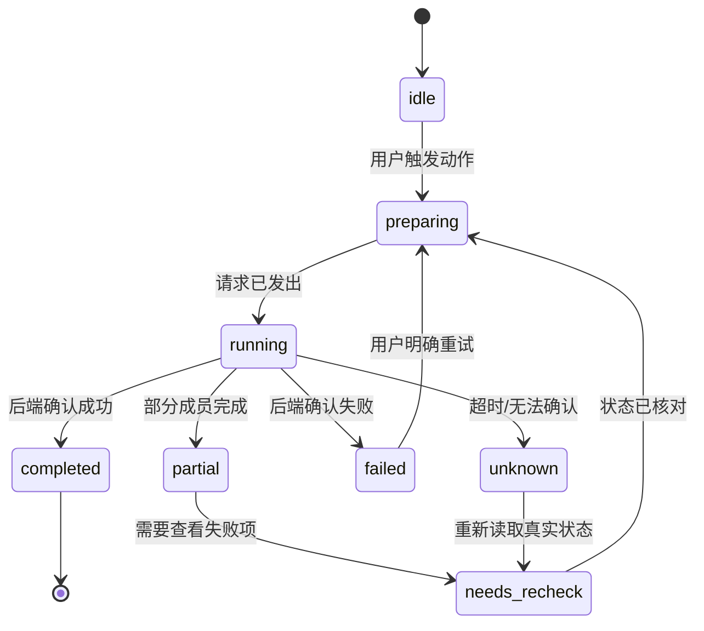

# EAC Market 前端视觉与交互重构实施计划

日期：2026-10-01
状态：**设计与实施计划阶段，尚未开始本轮代码实现**。

本文把 [视觉与交互方向合同](VISUAL-INTERACTION-DIRECTION-2026-10-01.md) 转换成可以逐阶段执行、逐阶段验收和随时回滚的工程计划。下一轮实现必须按本文的阶段顺序推进；如果实现过程中发现需求或后端合同需要改变，先暂停当前阶段，更新本文和对应合同，再继续。

## 1. 目标、范围和完成定义

### 1.1 总目标

把当前 EAC Market Client 从“功能完整但视觉骨架普通的卡片界面”升级成“高级、克制、可扫描、可恢复的编辑型插件目录工具”：

- 用户进入发现页后，能立刻理解首推内容、皮肤/高分内容和完整目录入口；
- 用户进入全部插件后，能快速搜索、筛选、比较和确认状态；
- 用户执行安装、启停、卸载、切肤、保存和 AI 操作时，始终知道当前阶段、真实结果和下一步；
- 视觉层级、动效、深色、窄面板、forced-colors、reduced-motion 和大字号都保持稳定；
- 前端升级不改变 Core、Remote、Host、安装协议和正式发行入口。

### 1.2 本轮允许修改

- `packages/market/src/client/**`
- `tests/client/**`
- `DESIGN.md`
- `docs/handoff/VISUAL-INTERACTION-DIRECTION-2026-10-01.md`
- 本文和对应交接记录

### 1.3 本轮禁止修改

- `packages/market-core/**`
- Core contracts、安装计划和任务协议
- Host / DSH adapter / 官方 pluginManager 接线
- `package.json`、锁文件和正式安装入口
- 真实用户 profile、官方源码、凭据、模型和外部作者制品

如果实现过程中发现某个视觉问题只能通过新增后端字段解决，先记录为“合同候选”，不能直接把它变成 Client 必需接口。

### 1.4 完成定义

本轮只有同时满足以下条件才算完成：

1. 发现页、全部插件、详情、任务、皮肤中心和作者工具都完成视觉重构；
2. 所有现有动作状态保持真实语义，`unknown` 不会被误读成成功；
3. 不产生发现页到全部插件的隐式跳转；
4. 返回能恢复来源、筛选、排序、分页、滚动和焦点；
5. 480px 窄面板、120%–200% 缩放、深色、forced-colors、reduced-motion 和长中文/英文包名仍可操作；
6. `pnpm typecheck`、`pnpm lint`、Client 测试、browser-check、Impeccable detect 和完整 `pnpm check` 通过；
7. 真实 DSH Desktop 验收项被逐项记录，不用合成 browser-check 冒充真实宿主通过。

## 2. 当前基线审查

### 2.1 视觉问题

当前 `marketStyles.ts` 和页面组件已经有基础 token、首推舞台、目录网格和状态样式，但视觉仍有以下结构性问题：

- 顶栏、页面标题、区块标题和按钮权重相近，首推舞台没有形成真正的第一视觉；
- 首推、皮肤、评分、规则发现和目录卡重复使用同一类边框/圆角/背景，内容类型没有视觉语法；
- 发现页区块像一串卡片堆叠，缺少编辑型页面的节奏和留白；
- 普通卡片使用阴影、边框和 hover 位移作为主要质感来源，导致界面像通用组件样例；
- 深色模式主要改变颜色，页面底、内容层、浮层和状态层的空间关系不足；
- 任务和作者工具内容准确，但呈现方式接近连续表单，缺少工作台的固定状态区和收尾感；
- 当前全局页面过渡能表达“换页”，但不能表达具体动作、结果和局部关系。

### 2.2 交互问题

- 页面状态虽然已经有 `NavigationSnapshot`，但视觉层仍需让来源、筛选和返回意图更明显；
- 筛选变化会改变结果，但当前界面缺少稳定的应用/结果节奏；
- 异步动作已经有统一状态层，但状态反馈仍需要更靠近触发动作、减少顶部全局提示依赖；
- 任务、皮肤和作者工作区都需要明确区分“正在做”“已完成”“结果未知”和“需要重新核对”；
- 动效目前以统一淡入为主，需要改为有明确原因的局部反馈。

### 2.3 技术事实

- Client 已经消费 `CatalogSnapshot.discovery`、`InventorySnapshot`、`PluginActionResult`、`TaskState`、作者 revision 和 skin runtime bridge；
- `action-state.ts` / `action-feedback.tsx` 已提供统一动作生命周期；
- 本轮不需要后端新增必需字段；
- `tests/client/browser-fixture.tsx` 和 `browser-check.mjs` 可以作为合成预览和回归基线；
- 合成预览只证明 Client 逻辑，不证明真实 DSH Desktop 宿主。

## 3. 方向决策与取舍

### 3.1 方案比较

| 方案 | 主要特征 | 优点 | 代价/风险 | 结论 |
| --- | --- | --- | --- | --- |
| A. Quiet Editorial Utility | 编辑型发现页、工具型目录、克制 surface、媒体舞台 | 高级感稳定；兼容性强；适合新手和维护者 | 需要重做布局和内容节奏，不能靠装饰快速见效 | **采用** |
| B. Dark Media-first | 深色底、图片主导、皮肤和海报优先 | 第一眼冲击强 | 缺图、对比度、forced-colors、低端设备和窄面板风险高 | 局部吸收，不作为全局方向 |
| C. Swiss Catalog Grid | 强网格、编号、列表和信息密度 | 目录扫描、比较和排序很强 | 发现页偏冷，新手对内容价值的理解变慢 | 只用于全部插件密度 |
| D. Glass / 3D Showcase | 玻璃、模糊、空间层和强动效 | 短期视觉变化大 | 对 GPU、旧浏览器、forced-colors 和 reduced-motion 不友好 | 不采用 |

### 3.2 选择 A 的具体理由

- 它可以使用官方 DSH token，而不需要独立品牌壳；
- 缺图、弱网络、旧浏览器和强制颜色模式下仍能降级为清晰的文字/边框结构；
- 可以同时容纳发现页的编辑感、目录页的工具感和任务页的可靠感；
- 不要求把 Core 的可选 discovery 数据变成必需数据；
- 能把“高级感”建立在比例、层级、对齐和内容节奏上，而不是依赖模糊、渐变或复杂动画。

## 4. 目标设计系统

### 4.1 Token 分层

在 `marketStyles.ts` 中重组为四类 token：

1. **Semantic color**：page、surface、surface-raised、surface-overlay、text、text-muted、border、accent、success、warning、danger、info。
2. **Typography**：display、title、section、body、meta、code；所有字体先走 DSH font token，再走系统 fallback。
3. **Geometry**：control radius、content radius、overlay radius、hairline border、content max width、gutter。
4. **Motion**：fast 120ms、standard 180ms、panel 240ms、enter/exit easing、reduced-motion override。

不再在各个组件里随意写新的颜色、阴影和圆角；组件只使用语义 token。

### 4.2 Surface 规则

- 页面底只提供环境，不抢内容；
- 普通内容使用边框和轻微背景差异；
- 提升层用于首推、当前选中、工作区和重要结果；
- 浮层只用于菜单、Modal、任务面板和真正脱离文档流的内容；
- 普通卡片禁止使用明显厚阴影；
- 深色模式单独调整 surface 对比，不能把浅色 token 简单取反。

### 4.3 Typography 规则

- 页面标题 30–42px，最多两行；
- 区块标题 18–22px，正文 14–15px，元信息 12–13px；
- 标题使用 `text-wrap: balance` 增强，旧浏览器保持普通换行；
- 包名、URL、版本和长中文允许断行；
- 任何重要动作和失败原因不能只靠截断省略；
- 代码、版本、摘要使用等宽字体只在确实表示代码/数据时使用。

### 4.4 Icon 和控件规则

- 使用一套统一的内联 SVG 图标，统一 stroke 宽度和 viewBox；
- 不用 emoji 或 Unicode 字符模拟图标；
- 主按钮只保留一个视觉主操作，次要动作使用 outline/ghost；
- `:hover` 只改变边框、背景和极小位移，不使用明显缩放；
- `:focus-visible` 必须在浅色、深色和 forced-colors 下清楚可见；
- 主要交互目标不小于 44px，窄面板也不减少触控区域。

## 5. 页面逐项实施方案

### Phase 0：基线和设计冻结

**目标**：固定当前事实，防止边做边换方向。

**修改文件**：

- `docs/handoff/VISUAL-INTERACTION-DIRECTION-2026-10-01.md`
- `docs/handoff/VISUAL-INTERACTION-EXECUTION-PLAN-2026-10-01.md`
- `DESIGN.md`

**工作内容**：

- 记录当前截图、viewport、主题和已知问题；
- 固定 token、页面密度、动作文案和状态颜色；
- 为每个页面写出“首要任务、主要动作、失败下一步”；
- 记录不变的 Remote/Core 边界。

**阶段验收**：

- 任何实现者只读合同即可知道页面应该长什么样、动作如何变化、什么不能改；
- 计划中不存在“后面再决定”的核心视觉或状态定义。

### Phase 1：页面壳和视觉骨架

**目标**：先消除“旧卡片壳”，再填内容。

**主要文件**：

- `packages/market/src/client/marketStyles.ts`
- `packages/market/src/client/MarketPage.tsx`
- `packages/market/src/client/ui.tsx`
- `packages/market/src/client/components.tsx`

**工作内容**：

- 重建顶栏、内容轨道、页头、区块头和 footer 的层级；
- 统一按钮、输入框、Pill、Status、Tag、Modal 的视觉语法；
- 建立宽面板/中面板/窄面板三套安全布局；
- 去掉普通卡片的厚阴影和同质圆角堆叠；
- 为菜单、Modal、任务面板建立真正的浮层层级；
- 先实现无渐变、无 blur 也成立的基础 CSS，再加可选增强。

**阶段验收**：

- 发现页和目录页在同一截图中看起来属于同一产品，但密度明显不同；
- 所有主要控件在无图片、深色、forced-colors 和旧 CSS 支持下仍可读；
- 不改变任何 Remote 调用和导航逻辑。

### Phase 2：发现页重构

**目标**：把发现页从“卡片集合”变成“编辑型精选首页”。

**主要文件**：

- `MarketPage.tsx` 中的 `DiscoverView`、`FeaturedPoster`、皮肤/评分/规则区块；
- `components.tsx` 中的 `PluginCard`、媒体失败状态；
- `marketStyles.ts` 中的 poster、section、skin strip、score list 样式；
- `tests/client/states.test.tsx`、`visual-polish.test.tsx`、`browser-check.mjs`。

**工作内容**：

1. 首推舞台：媒体区与信息区形成不等宽关系，只有这一块拥有强视觉重量。
2. 推荐皮肤：使用横向内容带，卡片强调预览、当前状态和使用动作。
3. 高分插件/Skill：使用排名式列表或不等宽内容块，避免四张同尺寸卡片。
4. 规则发现：使用紧凑筛选和目录项，明确“浏览全部插件”入口。
5. 缺数据：整块隐藏；缺图：同尺寸文字海报；图片失败：原地重试，不改变布局高度。

**交互要求**：

- 首推自动轮播只在多项时启用；悬停、焦点、页面隐藏、reduced-motion 时暂停；
- 手动切换不改变滚动位置、不进入全部插件；
- 分类筛选只在当前发现页过滤，明确点击“浏览全部插件”才进入目录；
- 进入全部插件时记录来源区块、分类、滚动和焦点。

**阶段验收**：

- 用户 3 秒内能看出首推内容和完整目录入口；
- 发现页不存在隐式跳转；
- 480px 截图没有横向溢出；
- 没有真实皮肤/评分/媒体时页面仍然完整但不显示空区块。

### Phase 3：全部插件和详情页重构

**目标**：让目录页真正像目录工具，让详情页真正像可信资料页。

**主要文件**：

- `MarketPage.tsx` 中的 `AllView`、`DetailView`、筛选和分页；
- `components.tsx` 的 `PluginCard`、`InventoryCard`、`SearchField`、`Status`；
- `model.ts` 的展示辅助函数保持纯函数；
- `marketStyles.ts` 的 directory/detail 样式；
- `tests/client/navigation.test.tsx`、`states.test.tsx`、`model.test.ts`。

**工作内容**：

- 目录顶部固定搜索、结果数、筛选摘要、排序和清除入口；
- 结果项固定显示名称、作者、简介、版本/兼容、验证状态和一个主要动作；
- 次要事实放详情，不把每个字段塞进卡片；
- 宽面板使用两列内容轨道，窄面板切换单列；
- 详情宽面板使用主内容 + 动作/事实栏，窄面板将动作栏置于简介之后；
- 来源/兼容/许可证使用渐进披露；
- 截图和媒体失败保留原位重试。

**阶段验收**：

- 搜索/筛选只更新目录结果，不跳页、不重置来源；
- 返回详情恢复原目录位置和焦点；
- 不可安装条目显示真实原因并禁用动作；
- 长包名和长中文不会撑破布局。

### Phase 4：任务、皮肤和作者工作台

**目标**：把高风险和高复杂度页面从“信息堆”变成工作台。

**主要文件**：

- `TaskDrawer.tsx`
- `SkinCenter.tsx`
- `AuthorWorkspace.tsx`
- `action-feedback.tsx`
- `ui.tsx` 的 Modal/Focus 逻辑
- 对应 Client 状态测试和 browser-check 场景

**工作内容**：

- 任务顶部固定标题、状态和关闭；中部下一步与逐项结果；底部当前动作；
- 任务关闭不取消，提交中遮罩/Escape 保护继续存在；
- AI 分析、脚本授权、重启核对和风险确认按状态渐进显示；
- 皮肤中心首屏强调当前外观、管理器状态和切换条件；
- 皮肤失败/回退/疑似残留/unknown 在目标皮肤旁显示恢复动作；
- 作者工作台宽屏左右分栏，窄屏按保存状态→编辑→预览→导出堆叠；
- 保存、README、媒体、导出统一使用动作反馈组件；
- 脏草稿离开时提供继续编辑和离开但保留编辑两种选择。

**阶段验收**：

- 任何任务状态都有可执行下一步；
- 关闭面板不会丢任务；
- 作者失败不会清空内容或伪造已保存；
- 皮肤结果未确认时不能直接重复切换。

### Phase 5：交互动效和细节

**目标**：把动效从“统一淡入”变成有原因的反馈。

**主要文件**：

- `marketStyles.ts`
- `MarketPage.tsx`
- `components.tsx`
- `TaskDrawer.tsx`
- `SkinCenter.tsx`
- `AuthorWorkspace.tsx`

**动效预算**：

| 交互 | 形式 | 时长 | 允许打断 |
| --- | --- | --- | --- |
| 主视图切换 | 内容区 opacity + 4px translate | 180ms | 是 |
| 首推轮换 | 媒体/文案交叉 | 220–260ms | 是 |
| 菜单/浮层 | opacity + 4px translate | 140ms | 是 |
| 结果更新 | 结果区轻微 opacity | 160ms | 是 |
| 状态反馈 | 图标/边框短反馈 | 120–180ms | 是 |

**禁止**：`transition: all`、无限 shimmer、重复卡片入场、自动 marquee、假进度、必须等动画结束才能操作。

**阶段验收**：

- reduced-motion 完全关闭非必要位移、自动轮播和装饰动画；
- 动效没有造成滚动跳动、焦点丢失或旧请求覆盖新状态；
- 页面截图在动画结束后保持稳定，不依赖动画才能看懂。

### Phase 6：兼容性和无障碍

**目标**：把“兼容”从 CSS 口号变成可复现检查。

**工作内容**：

- 基础 CSS 在不支持 container query、color-mix、dvh、backdrop-filter 时仍可用；
- forced-colors 下保留文字、边框、焦点和原生控件语义；
- 480px、720px、中等宽度和 120%–200% 缩放逐项截图；
- 长中文、英文包名、URL、版本、错误信息和代码块逐项检查；
- Modal/菜单/任务面板检查 Tab、Shift+Tab、Escape、焦点返回；
- 屏幕阅读器检查标题顺序、状态播报、按钮名称、错误和下一步；
- 图片失败、空数据、旧 Remote 缺能力和同步失败全部走静态 fallback。

### Phase 7：预览、回归和交付

**目标**：只在所有证据齐全后重新打开交互预览。

**命令顺序**：

```powershell
pnpm typecheck
pnpm lint
pnpm test -- tests/client
node tests/client/browser-check.mjs
& 'C:\Users\刘沛伦\.codex\skills\impeccable\scripts\impeccable.cmd' detect --json packages/market/src/client
pnpm check
```

**截图矩阵**：

- 1280px 浅色发现页；
- 480px 深色发现页；
- 480px 目录长内容；
- 480px 空结果；
- 480px 作者工具；
- 480px 任务/AI；
- 120% 和 200% 缩放；
- forced-colors；
- reduced-motion。

**交付物**：

- 新视觉方向合同；
- 实现提交；
- Client 定向测试结果；
- browser-check 结果和最新截图；
- Impeccable detect 结果；
- 真实 DSH Desktop 未验清单或通过证据；
- Client/后端对接说明。

## 6. 交互状态机



Client 只负责显示状态和允许下一步，状态事实仍来自 Remote/Core。

## 7. 风险、回滚和阶段门

### 7.1 主要风险

| 风险 | 预防 | 回滚 |
| --- | --- | --- |
| 视觉重构破坏旧 DSH token | 所有 token 保留 fallback；先测基础 CSS | 恢复上一阶段 `marketStyles.ts` 和组件提交 |
| 动效导致焦点/滚动抖动 | 所有导航使用 intent 和 snapshot；动效不改真实状态 | 关闭 motion enhancement，保留静态过渡 |
| 新布局挤压窄面板 | 每阶段同时跑 1280/720/480 | 回退到安全单列布局 |
| 旧 Remote 缺少可选字段 | 先判断 capability/字段存在，缺少时隐藏/降级 | 关闭新展示区块，不影响核心目录 |
| 视觉改动污染业务逻辑 | Client 只改展示与交互组合；纯函数保持不变 | 按文件 owner 回滚，禁止触碰 Core |
| 过度装饰导致可读性下降 | 对比度、forced-colors、reduced-motion 作为阶段门 | 删除装饰层，保留信息层 |

### 7.2 阶段门

- Phase 0 未冻结前，不改页面 CSS。
- Phase 1 未通过兼容基线前，不做发现页装饰。
- Phase 2 未通过无数据/图片失败/窄面板前，不做目录重构。
- Phase 3 未通过导航/筛选/详情返回前，不做任务页视觉调整。
- Phase 4 未通过真实失败状态前，不做最终动效。
- Phase 5–6 未通过 reduced-motion/forced-colors 前，不做最终截图验收。

## 8. 交接模板

每个阶段完成后在交接消息中写：

```text
阶段与日期：
当前 commit：
修改文件：
保留的 Core/Remote 边界：
视觉变化：
交互变化：
定向测试：
browser-check：
兼容性截图：
真实 DSH 验收：
未完成和下一阶段：
回滚点：
```

## 9. 计划结论

这次升级不是在旧卡片上继续加装饰，而是按“视觉骨架 → 页面密度 → 动作状态 → 动效 → 兼容性 → 真实宿主”的顺序重做。任何阶段如果只能靠再加一个阴影、渐变或 hover 来解决问题，应回到布局、内容层级和交互状态本身重新设计。
